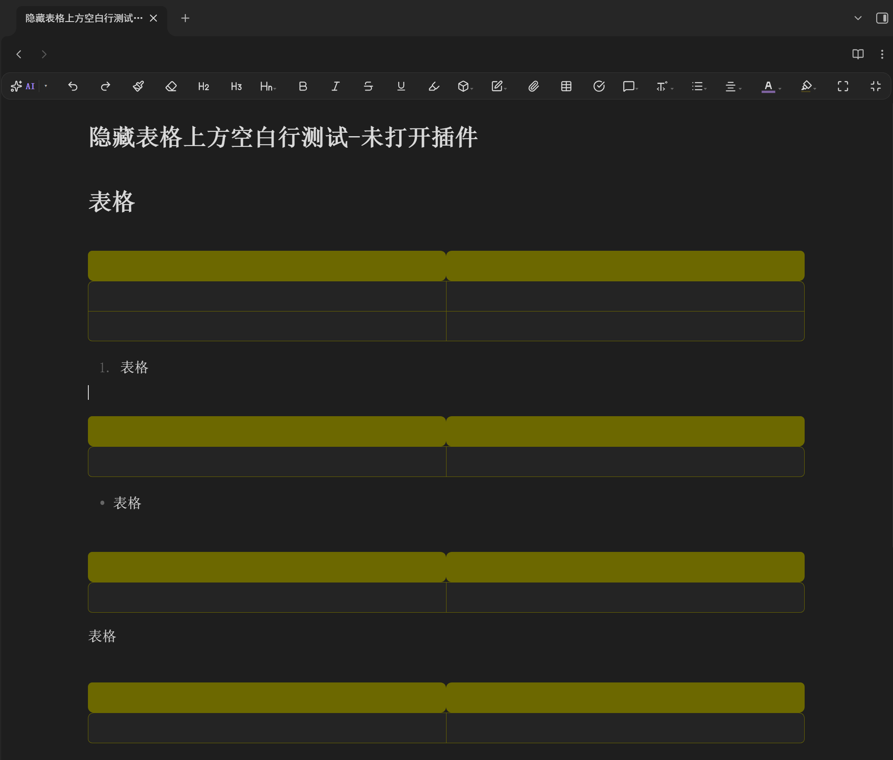

**Language / 语言:** [English](README.md) · [中文](README.zh.md)

# Spacing Control

Fine-tune the spacing (margins) of headings, paragraphs, lists and tables in Obsidian — in both **Live Preview** and **Reading View**.

> **Requires Obsidian 0.15.0 or higher.**

> **Domestic users (China):** the source code is also mirrored on Gitee: https://gitee.com/Dablieu/obsidian-spacing-control

## Features

- **Independent spacing control** — set the top/bottom margin of headings, paragraphs, lists and tables separately.
- **Hide the gap above tables (Live Preview)** — remove the extra clickable blank line above a table (`| ... |`) in Live Preview. The source markdown is never modified.
- **Compact table** — column width adapts to content (`table-layout: auto`); can be forced per-note via the `[紧凑表格]` / `[宽松表格]` cssclasses.
- **Table beautify** — customize border color / width / radius and header background color.

## Demo

Before (the gap above the table is visible and clickable):

After enabling Spacing Control, the gap above the table disappears:

## Installation

### From Community Plugins (once approved)
1. Settings → Community plugins → Browse
2. Search "Spacing Control"
3. Install & enable

### Manual
Copy the `obsidian-spacing-control` folder into your vault's `.obsidian/plugins/` directory, then enable it in Settings → Community plugins.

## How it works

- **Live Preview:** a CodeMirror 6 `ViewPlugin` adds a decoration class to the blank line directly above a table row, and an `EditorView.theme` (max priority) collapses it to zero height. Other spacing is applied via a dynamic `<style>` tag.
- **Reading View:** a `MutationObserver` scans rendered tables and headings, then sets inline styles to clear/adjust the relevant margins across all wrapper layers.

## Free & Open Source

This plugin is **completely free** and released under the MIT license. There is **no payment required** to use it, and no features are locked behind a paywall.

## Support the Development (Optional)

If you find this plugin helpful and would like to **voluntarily** support its development, you may send a tip via WeChat. This is entirely optional — the plugin remains free for everyone.

> ⚠️ **Voluntary donation** — this project is permanently free & open-source; no forced payment required. You may buy me a coffee to help cover servers, hardware, and ongoing development maintenance costs.

## License

[MIT](./LICENSE)
