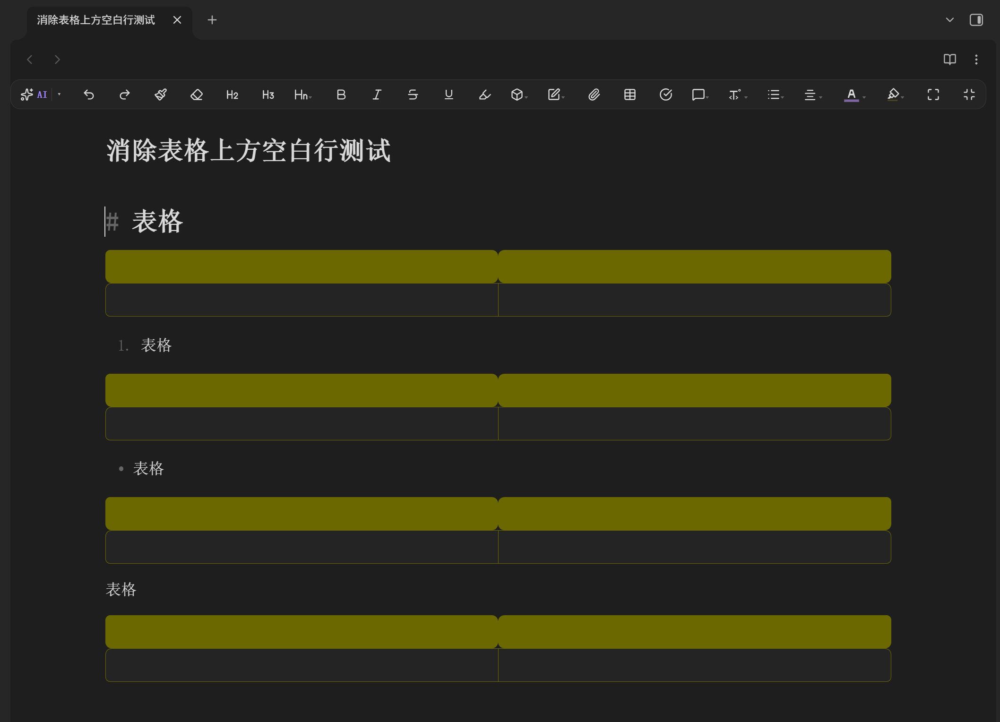

# Table Gap Remover

Hide the blank line above tables (and below headings) in Obsidian **Live Preview** mode.

## Problem

In Live Preview, a heading (`# ...`) or any block followed by a table (`| ... |`) always renders with an extra blank line in between. That line is clickable and visually distracting.

Standard CSS snippets and inline-style hacks cannot remove it — Obsidian's CodeMirror 6 editor re-renders and overwrites any external style on every frame.

## Solution

This plugin uses the official **CodeMirror 6 Decoration + Theme** API to hide those blank lines as part of the editor's own rendering pipeline. The hidden line is removed from layout but the source markdown is never modified.

- Blank line **below a heading** (`#`) → hidden
- Blank line **above a table** (`|`) → hidden
- Normal paragraph breaks (empty line between two text blocks) → **kept**

## Installation

### From Community Plugins (once approved)
1. Settings → Community plugins → Browse
2. Search "Table Gap Remover"
3. Install & enable

### Manual
Copy the `table-gap-remover` folder into your vault's `.obsidian/plugins/` directory, then enable it in Settings → Community plugins.

## How it works

The plugin registers a CodeMirror 6 `ViewPlugin` that adds a `rhg-gap-line` decoration class to empty lines that sit between a heading and the next block, or directly above a table row. An `EditorView.theme` with maximum priority collapses those lines to zero height.

## Demo

Before (blank line above table is clickable and visible):

After enabling Table Gap Remover, the gap disappears.

## License

[MIT](./LICENSE)
