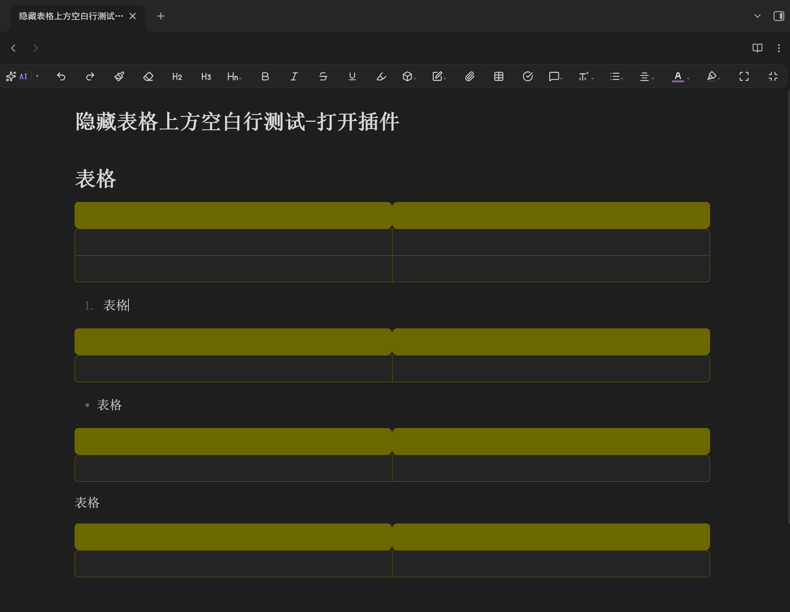

**Language / 语言:** [English](README.md) · [中文](README.zh.md)

# Table Gap Remover（消除表格上方空行）

在 Obsidian 的 **实时预览（Live Preview）** 模式下，隐藏表格上方的多余空行。

## 问题

在实时预览中，表格（`| ... |`）上方总会渲染出一条额外的空行。这条空行可被点击，且视觉上很干扰。

普通的 CSS 代码片段和内联样式方案都无法移除它 —— Obsidian 的 CodeMirror 6 编辑器会在每一帧重新渲染，并覆盖任何外部样式。

## 解决方案

本插件使用官方的 **CodeMirror 6 Decoration + Theme** API，将这些空行作为编辑器自身渲染流程的一部分进行隐藏。被隐藏的空行从布局中移除，但**源 Markdown 文本永远不会被修改**。

- 表格（`|`）上方的空行 → 隐藏
- 普通段落之间的正常分段空行 → **保留**

## 安装

### 通过社区插件市场（审核通过后）
1. 设置 → 社区插件 → 浏览
2. 搜索 “Table Gap Remover”
3. 安装并启用

### 手动安装
将 `table-gap-remover` 文件夹复制到你的仓库 `.obsidian/plugins/` 目录下，然后在 设置 → 社区插件 中启用。

## 工作原理

插件注册了一个 CodeMirror 6 `ViewPlugin`，为「紧贴表格行上方」的空行添加 `rhg-gap-line` 装饰类。再通过 `EditorView.theme` 以最高优先级将这些空行折叠为零高度。

## 效果演示

修复前（未开启 Table Gap Remover —— 表格上方的空行可见且可点击）：

启用 Table Gap Remover 后，表格上方的空行消失：

## 许可证

[MIT](./LICENSE)
